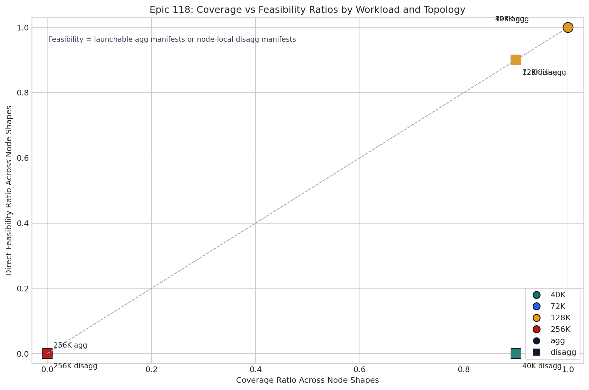
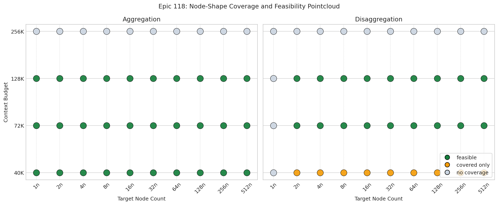

# Epic 118: Coverage and Feasibility

This section captures the AIConfigurator coverage gap for the K2/Qwen RL study without relying on `scripts/analysis/*`. The committed artifacts reduce the local exhaustive manifests into repo-safe tables and figures:

- Ratio summary: [118_coverage_feasibility_summary.csv](../data/118_coverage_feasibility_summary.csv)
- Per-node grid: [118_coverage_feasibility_grid.csv](../data/118_coverage_feasibility_grid.csv)
- Validation evidence: [118_validation_evidence.csv](../data/118_validation_evidence.csv)
- Rendered tables: [118_coverage_feasibility_tables.md](../data/118_coverage_feasibility_tables.md)

## Definitions

- `Coverage ratio`: fraction of requested node shapes that returned an AIConfigurator candidate manifest.
- `Feasibility ratio`: fraction of requested node shapes that were directly usable from the catalog.
- For `agg`, feasibility is measured from the launchable manifest variant.
- For `disagg`, feasibility is measured from whether the emitted manifest was already `node_local`.

Those definitions intentionally exclude after-the-fact manual retuning. The local repaired `4n` disagg manifests are treated as validation evidence, not as part of the raw feasibility ratio.

## Ratio Summary

| Workload | Experiment | Coverage Ratio | Feasibility Ratio | Read |
| --- | --- | ---: | ---: | --- |
| Practical RL 32K/8K | `agg` | 1.00 | 1.00 | Full coverage, but only the launchable rewrite removes the raw cluster-spanning script gap. |
| Practical RL 32K/8K | `disagg` | 0.90 | 0.00 | `2n` through `512n` are covered, but the raw manifests remain cross-node rather than node-local. |
| Practical RL 64K/8K | `agg` | 1.00 | 1.00 | Fully covered and directly usable. |
| Practical RL 64K/8K | `disagg` | 0.90 | 0.90 | Only `1n` is uncovered; every covered node shape is already node-local. |
| Stress RL 128K/16K | `agg` | 1.00 | 1.00 | Fully covered and directly usable. |
| Stress RL 128K/16K | `disagg` | 0.90 | 0.90 | Same pattern as `64K/8K`: `1n` is the only missing shape. |
| Stress RL 256K/32K | `agg` | 0.00 | 0.00 | No candidate manifests at any node count. |
| Stress RL 256K/32K | `disagg` | 0.00 | 0.00 | No candidate manifests at any node count. |

The practical outcome is simple:

- `40K` practical serving is searchable in both `agg` and `disagg`, but the raw `disagg` outputs are not directly usable.
- `72K` and `128K` keep the same `1n` disagg hole, but otherwise the emitted manifests are already node-local.
- `256K` is a true coverage failure, not just a launcher-shape issue.

The ratio scatter makes the outlier obvious: practical `32K/8K` disaggregation sits at `0.90` coverage and `0.00` direct feasibility, while the `256K/32K` stress tier collapses to `0.00 / 0.00` for both serving modes.

The pointcloud shows the same result at per-node granularity. `1n` disaggregation is missing across every workload tier, the `40K` disagg catalog entries stay orange because they are covered-but-not-node-local, and the `256K` tier is gray end-to-end.

## Validation Evidence

The raw feasibility ratio for practical `32K/8K` disaggregation is deliberately conservative, but the local validation evidence shows that the gap is mostly an artifact-shaping problem rather than a hard serving limit:

- The direct `4n` disagg candidate passed the small `32` request validation run.
- The first `8k`-request `4n` run only completed `1932 / 8000` requests.
- The tuned node-local `4n` manifests then completed `8000 / 8000` requests twice, at `6.58` and `6.69` requests/s.

That is the core feasibility finding for epic `#118`: the exhaustive catalog already has enough search coverage to find promising `40K` disagg layouts, but it does not yet emit them in the directly usable shape that the `64K` and `128K` tiers already achieve.
