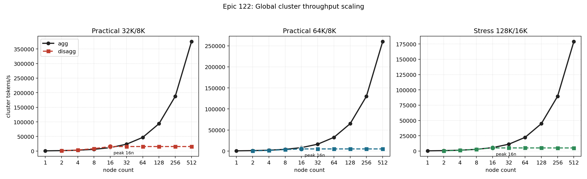
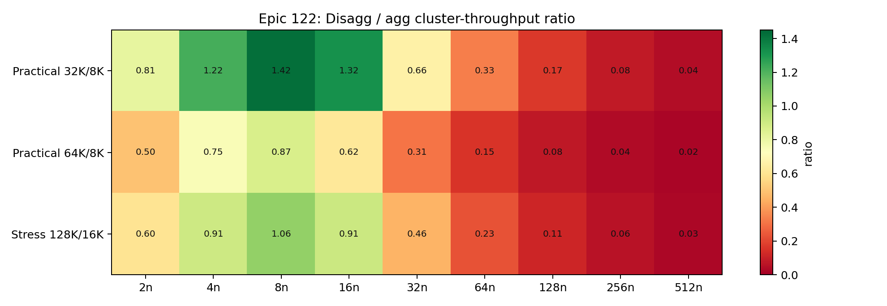
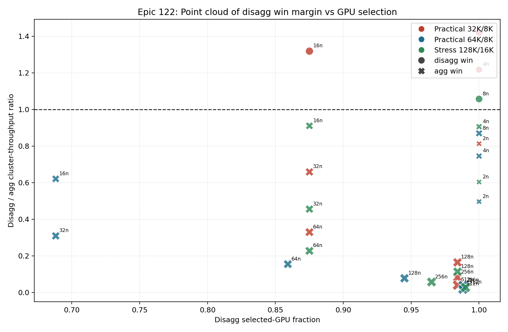

# Epic 122 Figures

This section collects the figure artifacts for the RL360 global-scaling epic.
All image outputs are epic-scoped and live under `figures/122_*`.

## Figure Inventory

### Cluster Capacity Scaling

The agg path scales linearly because the selected `8`-GPU serving replica is repeated across nodes.
The disagg path grows through `16n`, then flattens.

### Disagg To Agg Ratio Heatmap

The heatmap highlights the narrow region where disagg wins on total cluster throughput:

- `practical_32k_8k`: `4n`, `8n`, and `16n`
- `stress_128k_16k`: `8n`
- `practical_64k_8k`: no disagg cluster-throughput wins

### Disagg Efficiency Point Cloud

This point-cloud view is the required non-heatmap/non-line figure for the epic.
It shows how disagg win margin relates to selected-GPU fraction:

- points above `1.0` are disagg cluster-throughput wins
- circle markers are disagg wins; `X` markers are agg wins
- the `16n` points show where disagg can stay efficient while already leaving GPUs idle
