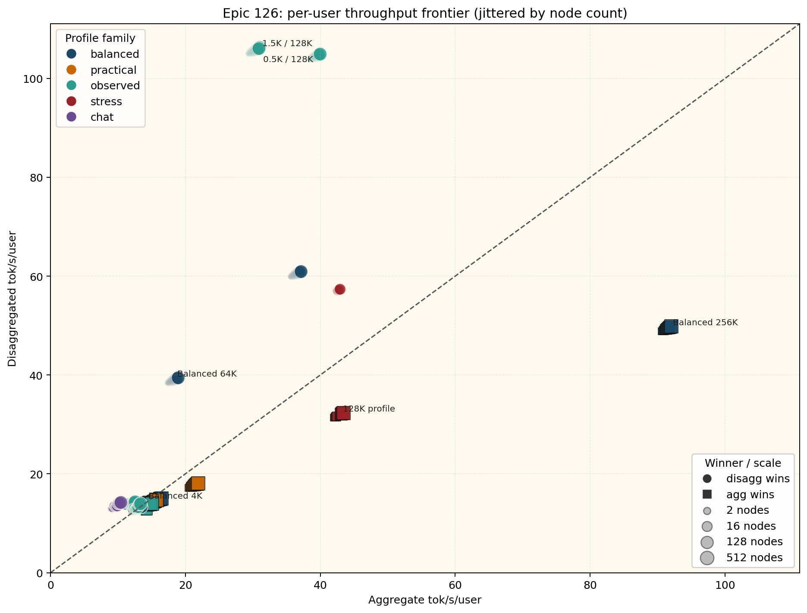
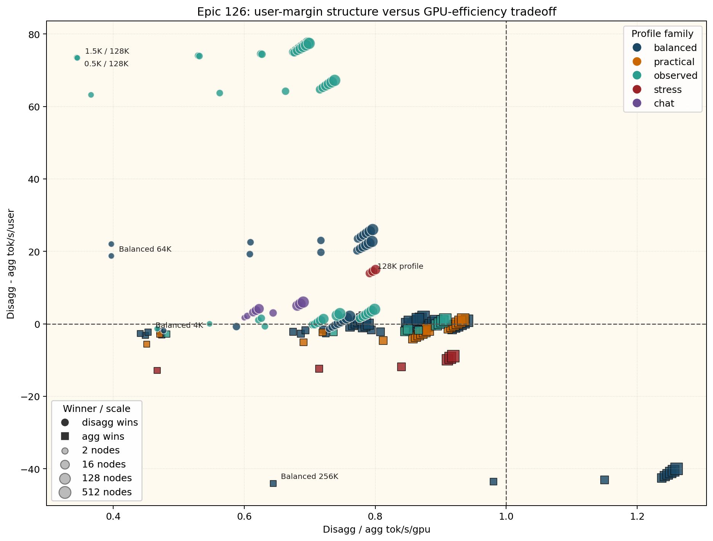

# Epic 126: Inference Decision

This section reduces the additive-band AIConfigurator catalog to the inference-only question for RL360:
when should the serving plan stay aggregated, and when should it split prefill from decode?

## Scope

- Source data: [../data/126_inference_pairwise.tsv](../data/126_inference_pairwise.tsv)
- Profile rollup: [../data/126_inference_profile_summary.tsv](../data/126_inference_profile_summary.tsv)
- Compact table: [../data/126_inference_decision_table.md](../data/126_inference_decision_table.md)

The catalog spans `15` additive load bands from `load_000001` through `load_016384`.
For every profile, node count, and topology, the selected inference candidate is identical across those load bands.
That means the inference decision collapses to a unique `20 x 10` profile-by-node frontier.

## Executive Read

- Disaggregation is the clear user-throughput winner for long-context and observed `128K`-class shapes.
  The strongest gains are `3.495x` to `3.498x` on the observed `128K` profiles, `2.661x` on `7K / 128K`, `2.140x` on balanced `64K`, and `1.659x` on balanced `128K`.
- Aggregation retains the edge for the practical RL `32K / 8K` and `64K / 8K` shapes, for most balanced `8K` to `32K` profiles, and for the balanced `256K` extreme.
  The largest aggregate holdout is balanced `256K`, where disagg drops to `0.540x` of aggregate `tok/s/user`.
- Near-parity cases exist, but they are narrow.
  Balanced `1K` favors disagg by only `0.7%`, balanced `2K` favors agg by `0.4%`, and balanced `4K` flips only at `8` nodes.
- Candidate availability is itself part of the decision.
  Every profile is missing a `1`-node disagg candidate, and the `256K` stress profile has no disagg candidate at any node count.

## Figures

Figure 1 compares agg and disagg `tok/s/user` directly.
Small node-count jitter is applied only in the figure so stacked `2` to `512` node selections remain visible.
Points above the diagonal favor disagg on per-user throughput; points below it favor agg.

Figure 2 shows the key tradeoff that drives the decision.
Many disagg winners live left of `1.0` on `tok/s/gpu` while still sitting above `0` on user margin.
In other words, disaggregation often gives up GPU efficiency in exchange for materially better `tok/s/user`.

## Decision Rules

1. Prefer disagg for `64K+` decode-heavy or observed `128K`-class profiles.
   These are the profiles where user throughput improves by `1.66x` to `3.50x` even though `tok/s/gpu` usually falls into the `0.36x` to `0.78x` range of agg.
2. Prefer agg for the practical RL rollout shapes and for the balanced short-to-mid context band.
   Practical `32K / 8K` lands at `0.944x` on disagg user throughput, practical `64K / 8K` at `0.831x`, and balanced `16K` to `32K` stays in the `0.923x` to `0.929x` range.
3. Treat `1K` to `4K` and the `128K` stress profile as boundary cases.
   Balanced `1K`, balanced `2K`, and balanced `4K` are effectively parity decisions, while `128K` stress flips from agg at `2` to `8` nodes, to disagg at `16` to `64`, and back to agg at `128+`.

## What This Means For RL360

For the inference-side branch decision alone, the cleanest split is:

- Default to agg for practical RL training shapes and for short-to-mid balanced profiles.
- Switch to disagg when the workload looks like the observed `128K` cluster or the balanced `64K` and `128K` families.
- Flag `stress_128k`, balanced `1K` to `4K`, and any `1`-node deployment as measurement-first exceptions rather than fixed policy.

This keeps the epic focused on the serving decision itself.
Measured runtime validation and reproducibility automation stay outside this PR.
